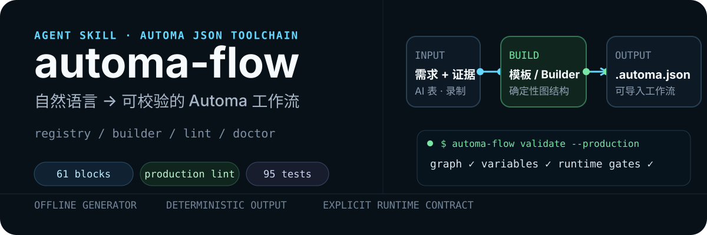
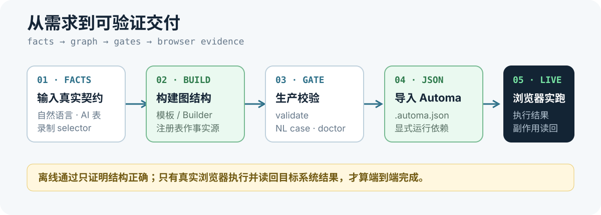

<p align="center">
  
</p>

<p align="center">
  <code>61-block registry</code>&nbsp;&nbsp;·&nbsp;&nbsp;<code>8 CLI commands</code>&nbsp;&nbsp;·&nbsp;&nbsp;<code>2 templates</code>&nbsp;&nbsp;·&nbsp;&nbsp;<code>95 tests passing</code>
</p>

`automa-flow` 把 Automa 编辑器里的手工拖拽，变成 agent、代码或 CLI 可重复生成并校验的 `.automa.json`。Agent 负责理解自然语言，CLI 负责用固定的块注册表、图连接规则和生产门禁输出确定性结果。

> [!IMPORTANT]
> 这是独立的 Agent Skill 与 CLI 快照，不是 Automa 浏览器扩展，也不代表 Automa、钉钉或内容平台的官方集成。生成与离线校验不等于真实浏览器执行成功。

## 为什么值得用

| 事实源 | 生成 | 验收 |
| --- | --- | --- |
| 固化 Automa `1.30.00` 的 61 个块定义 | 模板或 `WorkflowBuilder` 产出 drawflow JSON | `validate --production`、`doctor` 与 NL 用例分层把关 |
| 不凭记忆猜 block label 或连接端口 | AI 表字段显式映射为 Automa 变量 | `MANIFEST.json` 为交付文件记录 SHA-256 |

<p align="center">
  
</p>

## 30 秒跑通

先用 GitHub CLI 预览并安装 Skill：

```bash
gh skill preview 784697524-ux/automa-flow automa-flow
gh skill install 784697524-ux/automa-flow automa-flow \
  --agent codex --scope user
```

CLI 位于 Skill 内的 `vendor/automa-flow`。首次使用安装依赖，然后读取本地块注册表：

```bash
cd ~/.codex/skills/automa-flow/vendor/automa-flow
pnpm install --frozen-lockfile
node bin/automa-flow.mjs list-blocks
```

生成、校验并检查一份工作流：

```bash
node bin/automa-flow.mjs generate xhs-publish \
  --config ./xhs.config.json \
  -o ./xhs-publish.automa.json

node bin/automa-flow.mjs validate ./xhs-publish.automa.json --production
node bin/automa-flow.mjs doctor ./xhs-publish.automa.json
```

不使用 Agent Skill 时，也可以直接克隆仓库：

```bash
gh repo clone 784697524-ux/automa-flow
cd automa-flow/skills/automa-flow/vendor/automa-flow
pnpm install --frozen-lockfile
```

运行环境：Node.js `>=20.18.0`，pnpm 版本以 [`package.json`](./skills/automa-flow/vendor/automa-flow/package.json) 的 `packageManager` 为准。

## CLI 能力

| 命令 | 用途 |
| --- | --- |
| `list-blocks` | 列出注册表中的 Automa 块 |
| `inspect-block <label>` | 查看块端口、默认数据与连接约束 |
| `generate <template>` | 从配置生成 `.automa.json` |
| `import <workflow>` | 分析录制或导出的工作流与 selector |
| `merge <skeleton> <recording>` | 把线性录制片段插入工作流骨架 |
| `validate <workflow> --production` | 检查图结构、模板语法与生产硬规则 |
| `doctor <workflow>` | 输出 Credentials、Storage Variables 与权限清单 |
| `check-nl-case <case> <workflow>` | 用自然语言验收用例验证生成物 |

内置模板只有两个：`xhs-publish` 与 `douyin-publish`。它们提供结构脚手架，不包含可跳过现场确认的生产账号、字段映射或页面 selector。

## 生产边界

在生成真实业务工作流前，必须确认：

- AI 表的 `baseId`、`sheetId/tableId`、`operatorId` 与真实字段结构；
- “表字段 → Automa 变量 → 页面元素”的完整映射；
- selector 来自 Automa 录制或浏览器证据，而不是猜测；
- Credentials 或 Storage Variables 的凭据来源，不把密钥写进 JSON；
- 附件字段的真实 URL、文件名与 MIME 结构；
- 发布、回写等副作用动作的幂等规则与读回方式。

交付状态必须分层说明：

1. `generated` — 已生成 JSON；
2. `imported` — 已成功导入 Automa；
3. `offline-replay` — 离线结构与用例已通过；
4. `browser-run` — 已在真实浏览器运行；
5. `side-effect-readback` — 发布或回写结果已从目标系统读回。

详细硬规则见 [`production-hardening.md`](./skills/automa-flow/production-hardening.md) 与 [`delivery.md`](./skills/automa-flow/delivery.md)。

## 文档地图

- [`SKILL.md`](./skills/automa-flow/SKILL.md) — Agent 入口、生成流程与硬规则
- [`recording.md`](./skills/automa-flow/recording.md) — 用 Automa 录制获取 selector 证据
- [`openapi.md`](./skills/automa-flow/openapi.md) — 钉钉 AI 表 OpenAPI 边界与凭据策略
- [`production-hardening.md`](./skills/automa-flow/production-hardening.md) — 认证、分页、附件、发布和回写门禁
- [`delivery.md`](./skills/automa-flow/delivery.md) — 从 JSON 到浏览器验证的分层交付标准
- [`vendor/automa-flow/README.md`](./skills/automa-flow/vendor/automa-flow/README.md) — CLI 参数、模板与实现细节

## 仓库结构

```text
.
├── README.md                      # GitHub 首页
├── assets/readme/                 # 纯 SVG 视觉资产
└── skills/automa-flow/
    ├── SKILL.md                   # Agent Skill 入口
    ├── delivery.md                # 交付与验证分层
    ├── MANIFEST.json              # 文件大小与 SHA-256
    └── vendor/automa-flow/
        ├── bin/automa-flow.mjs    # CLI 入口
        ├── src/                   # Builder、模板、lint、doctor
        └── test/                  # 单元测试与 NL 验收用例
```

## 开发与验证

```bash
cd skills/automa-flow/vendor/automa-flow
pnpm install --frozen-lockfile
pnpm typecheck
pnpm test
```

当前仓库包含 8 个 Vitest 测试文件和 2 个自然语言验收用例；当前副本已通过 `95/95` 项测试与 TypeScript 检查。发布前还应运行：

```bash
gh skill publish --dry-run .
```

## 安全说明

- 仓库不包含真实 appKey、appSecret、access token 或个人 operatorId；示例只使用占位符。
- `.env`、`node_modules`、构建产物与 macOS 元数据均被忽略。
- `doctor` 会列出运行时依赖，但不会替你注入凭据。
- License 尚未选择；如需开放再分发或贡献，请先补充明确许可证。
